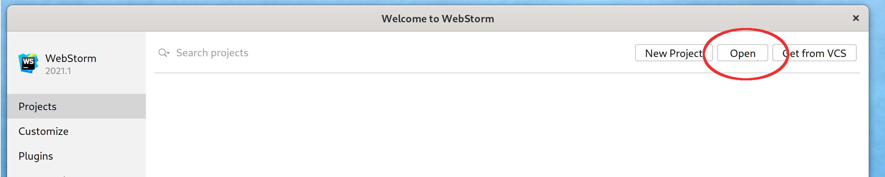
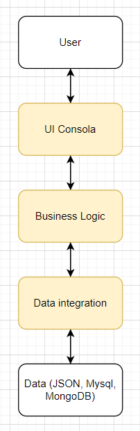

# DevTeam's TO-DO App

## Initial Project README

### Project Structure

Main structure of node.js project. Folders / files:

- <b>\_\_tests__</b>. Tests folder. See [Jest Docs](https://jestjs.io/es-ES/docs/configuration) and [Chai Docs](https://www.chaijs.com/)
- <b>app</b>:
    - <b>config</b>
    - <b>controllers</b>
    - <b>crons</b>
    - <b>middleware</b>
    - <b>models</b>
    - <b>routes</b>
    - <b>tmp</b>
    - <b>app.js</b>. Entry point.
- <b>.env</b>. Environment descriptor. See [dotenv doc](https://www.npmjs.com/package/dotenv).
- <b>.eslintrc</b>. Linter JS, static code analyzer. See [EsLint Docs](https://eslint.org/docs/user-guide/configuring/configuration-files).
- <b>.prettierignore</b>. Code formatter. See [Prettier Config](https://prettier.io/docs/en/configuration.html) and [Prettier Ignore](https://prettier.io/docs/en/ignore.html).
- <b>.ecosystem.config.js</b>. Process Manage at runtime. See [PM2 Docs](https://pm2.keymetrics.io/).
- <b>package.json</b>.

### Import project for use with WebStorm

Follow the steps below:
* Clone the project from the Github Platform. Execute:
  ```
  git clone [url project]
  ```
* Open the project downloaded.



### Import project for use with Visual Studio Code

Follow the steps below:
* Clone the project from the Github Platform. Execute:
  ```
  git clone [url project]
  ```
* Open the project downloaded.
  


### Utilities

* [Node Developers Guide](https://nodejs.dev/learn)
* **.gitignore file** configuration. See [Official Docs](https://docs.github.com/en/get-started/getting-started-with-git/ignoring-files).
* **Git branches**. See [Official Docs](https://git-scm.com/book/en/v2/Git-Branching-Branches-in-a-Nutshell)

## App Architecture

Arquitectura típica de 3 capes, repartides entre les 3 integrants del grup:



|  **Component**   | **Integrant** |
|:----------------:|:-------------:|
|    UI Consola    |   Patricia    |
|  Business Logic  |     Laura     |
| Data integration |    Guillem    |


## Disseny de dades

### Casos d'ús
- Crear tasca
- Actualitzar tasca
- Esborrar tasca
- Llistar totes les tasques
- Llistar una tasca

### Model de dades SQL

#### Task Table
- id: int PK autoincrement not null
- description: text not null
- state: enum(pendent, execució, acabades) not null
- start_time: Timestamp (pot ser null: podem afegir tasques una darrera l'altra i decidir l'inici de cada una d'elles més endavant a cas d'ús: actualitzar tasca)
- end_time: Timestamp (null quan no s'ha acabat)
- author: int FK a User not null

#### User Table
  - id: int PK autoincrement not null
  - name: String not null

#### Observacions
- En crear una tasca, s'inicialitza l'estat a pendent i s'incorpora current time a start_time per defecte. 

### Model JSON / MongoDB

#### tasks Collection
  - id: int (JSON) / oid (MongoDB)
  - description: String
  - state: enum('pending', 'open', 'finalized')
  - start_time: Date
  - end_time: Date
  - author: String

#### Observacions
- Mantinc id en tots els casos perquè caldrà poder recuperar tasques individualment.
- De moment no incorporo més indexs, es podria plantejar de fer en un futur.
- A JSON no sé com buscar una sola tasca dins del file, així que he acabat carregant tot el file en memòria i guardar-lo tot quan es doni qualsevol modificació.
- A JSON ha calgut guardar un sol objecte perquè el format sigui vàlid: `{ "tasks": [{/*task1*/}, {/*task2*/}...]}`


## Capa: Data integration

### dotenv

- Proposta: he fet servir dotenv ([Documentació](#project-structure)) per carregar variable d'entorn que determini el tipus de permanència.
- Per no afectar la resta de capes de l'app, les 3 implementacions tenen la mateixa interfície d'ús.


### Suport al desenvolupament
- Si feu servir Webstorm, no incorpora dotenv d'entrada als run configurations (per exemple debug no funciona), cal editar les configuracions del run: https://ihsanmjdeci.medium.com/webstorm-load-env-file-run-debug-test-configuration-904f343814da. A la nostra app: `-r dotenv/config`, `DOTENV_CONFIG_PATH=../.env`.
- Per executar app.js des de Webstorm i que tots els paths funcionin com fent `npm start` o `npm run dev`, també cal establir el working directory com el root del repositori i no la carpeta `app` que és el que ve per defecte.

### Instruccions d'ús
- El que conté la branca a nivell d'app és una demo per provar les diferents implementacions de Tasks.
- Per correr la demo: `git clone`, `npm install`, `npm start`. També hi ha script `npm run dev` per iniciar aplicació amb `nodemon` en comptes de `node`.
- Abans d'executar els npm scripts, anar a `.env` i seleccionar el tipus de permanència que volem (opcions: "JSON", "MYSQL", "MONGODB").
- Si triem MongoDB, caldrà tenir una instància corrent en localhost : port 27017, o bé modificar la URI al mateix `.env` file. En producció, canviar la URI per la de producció a `.env`.
- Si triem MySQL, caldrà tenir una instància corrent en localhost i, a més: 
  - Crear les taules el primer cop que executem l'app (executant script `/mysql_scripts/mysql_schema.sql`).
  - Crear l'usuari de l'app i donar-li els privilegis que calgui (executant script `/mysql_scripts/mysql_user.sql` després de fer el punt anterior). 
  - En producció, caldrà canviar el password perquè sigui segur (a `mysql_user.sql`i a `.env`) i canviar també la direcció del host de MySQL a `.env` pel real.

### Integració a la resta de l'app
- S'ha completat el desenvolupament de la branca i està llesta per ser usada des de la resta de l'aplicació.
- Hi ha una sola demo a `app/app.js` amb un exemple de tots els usos de la capa: per provar els diferents mecanismes, només cal canviar `STORAGE_TYPE` a `.env`.
