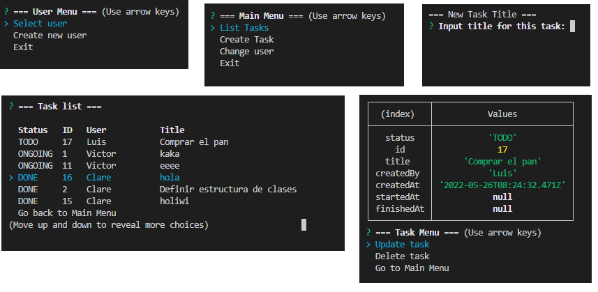

# Developers Team - Todo List

## Descripción proyecto
Todo-List por consola, utilizando node.js y la librería inquirer (https://www.npmjs.com/package/inquirer).
Para la persistencia de las tareas se utiliza json, mongoDB o MySQL (según se configure en `.env`)


## Autores
Clare ([@klarema](https://github.com/klarema)), Victor ([@vicmape](https://github.com/vicmape)), Luis ([@qfluis](https://github.com/qfluis))

## Metodología
Cada dev ha trabajado las issues asignadas en su rama de desarrollo y al finalizar ha hecho pull request a la rama DevTeams (main). Los pull request han sido revisados en equipo, para estar tod@s alineados.
Tareas organizadas mediante Issues de Github.
Puedes ver las issues generadas en este mismo repo 😃.

## Instrucciones
Proyecto realizado en JS para plataforma node. Es necesario tener instalado previamente node y npm. Si no los tienes instalados, lo puedes hacer en esta dirección: https://nodejs.org/es/ (instalando node también instalas npm)

### Instalar dependencias
```
npm install
```
### Configurar Variables de entorno
Es necesario tener un fichero `.env` en la raiz del proyecto con las variables de entorno necesarias para que funcionen las bases de datos.
En el fichero `.env-template` puedes encontrar un ejemplo. El contenido del `.env-template` es el siguiente:
```
//PERSISTENCIA

//DB=json
//DB=mongo
DB=sql

DB_NAME=DevTeams_luis_clare_victor
DB_HOST=localhost
DB_USER=root
DB_PASS=1234

//Default MongoDB
//DB_PORT=27017

//Default MySQL
DB_PORT=3306
```
Según el valor de la variable <b>DB</b> se utilizará uno u otro sistema de persistencia:
- <b>DB=json</b>: Se utilizará un fichero json.
- <b>DB=mongo</b>: Se utilizará MongoDB.
- <b>DB=sql</b>: Se utilizará MySQL.
Importante que también configures correctamente la variable `DB_PORT` según la base de datos seleccionada.

### Iniciar proyecto:
```
npm init
```
¡Gracias!